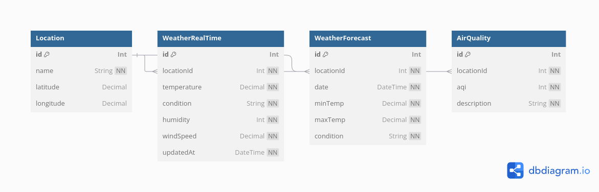

# Weather API

This API allows you to access real-time weather data, weather forecasts, air quality data, and locations. The data is fetched from the corresponding tables in the database.

## Database Design

Below is the database design diagram:

